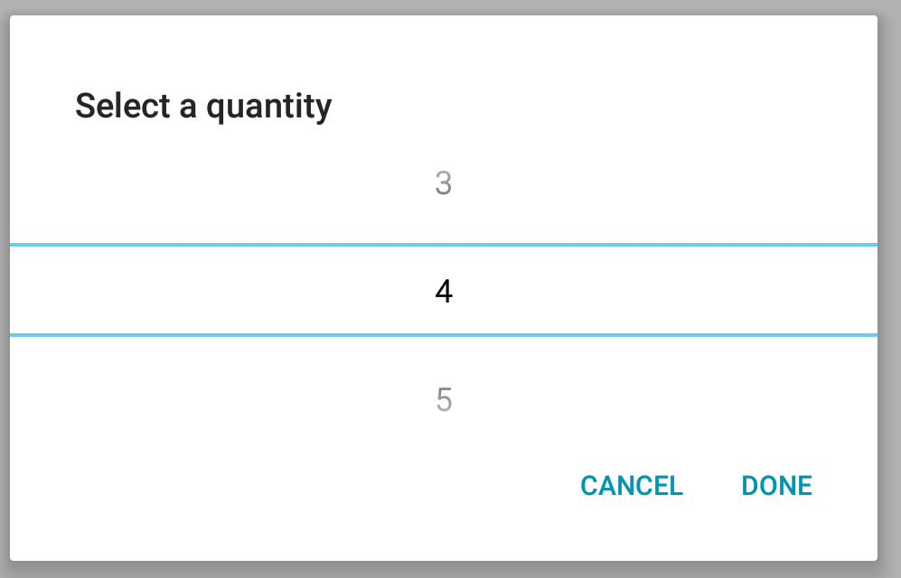
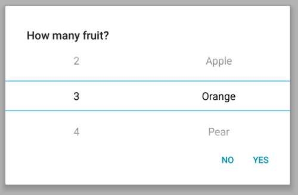
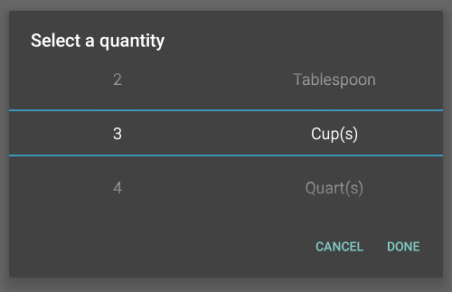
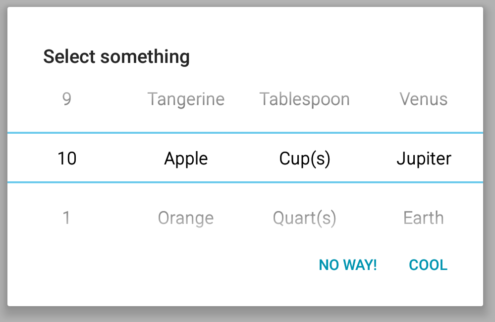
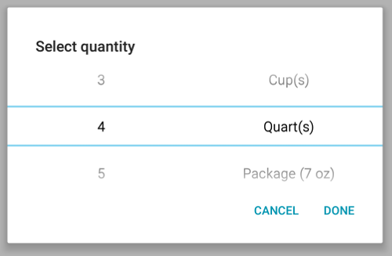

# Cordova wheel selector plugin
Native wheel selector for Cordova (Android/iOS).

Can use in Cordova or Ionic (v1 or v2) frameworks, calls native API's so no clunky javascript used.  Can send in as many *data sets* as needed, the UI will *grow* or *shrink* accordingly (see examples for info).

<!-- TOC depthFrom:1 depthTo:6 withLinks:1 updateOnSave:1 orderedList:0 -->

- [Cordova wheel selector plugin](#cordova-wheel-selector-plugin)
- [Installation](#installation)
- [Usage](#usage)
	- [The options that can be set](#the-options-that-can-be-set)
	- [The functions that can be called](#the-functions-that-can-be-called)
- [Screenshots and Examples](#screenshots-and-examples)
	- [Android](#android)
	- [iOS](#ios)
	- [Sample Data](#sample-data)
	- [Single items, white theme](#single-items-white-theme)
	- [2 items white theme](#2-items-white-theme)
		- [Results:](#results)
		- [Ouputs:](#ouputs)
	- [2 items dark theme](#2-items-dark-theme)
	- [Many items white theme, with 'wheel wrapping'](#many-items-white-theme-with-wheel-wrapping)
	- [Default items](#default-items)
	- [More complicated usage](#more-complicated-usage)
- [Ionic](#ionic)
- [Development](#development)
	- [Android](#android)
	- [IOS](#ios)
- [TODO](#todo)
- [Credits](#credits)

<!-- /TOC -->

# Installation

This plugin will work in Ionic v1 AND Ionic v2!

Installation via command line Ionic v1:

`cordova plugin add cordova-wheel-selector-plugin`


Installation (and Docs) via command line Ionic v2:

[https://ionicframework.com/docs/native/wheelselector-plugin/](https://ionicframework.com/docs/native/wheelselector-plugin/)


# Usage

## The options that can be set

```js
var config = {
    title: "The title",
    items:[
        //how many items to display, see examples below
        //the order of the items dictates the order they are displayed in the UI
        //also the result has an index which refers to the ordering (see examples below)
    ],
    defaultItems: {
        //which items to display, example [{"0" :"2"},{"1" :"Apple"}] (index:value}
    },
    positiveButtonText: "Yes",
    negativeButtonText: "No",
    theme: "light | dark",  //lighter or darker theme, not available on iOS yet
    wrapWheelText: true | false, //wrap the wheel for infinite scroll, not available on iOS

    //advanced usage:
    displayKey: "description" //so can send in different json - see examples below

};

```

## The functions that can be called

```js

SelectorCordovaPlugin.showSelector(); //shows the selector

SelectorCordovaPlugin.hideSelector(); //programatically hides the selector - currently iOS only

```

# Screenshots and Examples

## Android


## iOS


## Sample Data

Create your data (or get it from a server API call):

```js
var data = {
    numbers: [
        {description: "1"},
        {description: "2"},
        {description: "3"},
        {description: "4"},
        {description: "5"},
        {description: "6"},
        {description: "7"},
        {description: "8"},
        {description: "9"},
        {description: "10"}
    ],
    fruits: [
        {description: "Apple"},
        {description: "Orange"},
        {description: "Pear"},
        {description: "Banana"},
        {description: "Grapefruit"},
        {description: "Tangerine"}
    ],
    measurements: [
        {description: "Teaspoon"},
        {description: "Tablespoon"},
        {description: "Cup(s)"},
        {description: "Quart(s)"},
        {description: "Packages (7 oz)"},
        {description: "Packages (12 oz)"}
    ],
    planets: [
        {description: "Venus"},
        {description: "Jupiter"},
        {description: "Earth"},
        {description: "Pluto"},
        {description: "Neptune"}
    ]
};

//config here... (see config for each screenshot below to get desired results)
var config = {...};

//do something useful with the result:
window.SelectorCordovaPlugin.showSelector(config, function(result) {
    console.log("result: " + JSON.stringify(result) );
}, function() {
    console.log('Canceled');
});


```

## Single items, white theme
Using config:

```js
var config = {
    title: "Select a quantity",
    items:[
        [data.numbers]
    ],
    positiveButtonText: "Done",
    negativeButtonText: "Cancel"
};

```
Produces:




## 2 items white theme
Using config:

```js
var config = {
    title: "How Many Fruit?",
    items:[
        [data.numbers],
        [data.fruits]
    ],
    positiveButtonText: "Yes",
    negativeButtonText: "No"
};

```
Produces:




### Results:
```js
window.SelectorCordovaPlugin.showSelector(config, function(result) {
    console.log("result: " + JSON.stringify(result) );
    console.log('User chose number: ' + result[0].description + ' at array index: ' + result[0].index);

    //note: as of now in iOS result[1] is ignored
    console.log('User chose fruit: ' + result[1].description + ' at array index: ' + result[1].index);
}, function() {
    console.log('Canceled');
});

```
### Ouputs:

```
"result: [{"index":2,"description":"3"},{"index":1,"description":"Orange"}]"
"User chose number: 3 at array index: 2"
"User chose fruit: Orange at array index: 1"

```


## 2 items dark theme
Using config:

```js
var config = {
    title: "Select a quantity",
    items:[
        [data.numbers],
        [data.measurements]
    ],
    theme: "dark",
    positiveButtonText: "Done",
    negativeButtonText: "Cancel"
};

```
Produces:




## Many items white theme, with 'wheel wrapping'
Using config:

```js
var config = {
    title: "Select something",
    items:[
        [data.numbers],
        [data.fruits],
        [data.measurements],
        [data.planets]
    ],
    wrapWheelText: true,
    positiveButtonText: "Cool",
    negativeButtonText: "No way!"
};

```
Produces:





## Default items

**Note:** If you have `n` `items`, then you must set `n` `defaultItems`, meaning the number of `items` and number of `defaultItems` must be the same

Using config:

```js
var config = {
    title: "Select something",
    items:[
        [data.numbers],
        [data.fruits]
    ],
    defaultItems: [
        //the number '2'
        {index:0, value: data.numbers[2]},

        //the value 'Pear'
        {index:1, value: data.fruits[2]}
    ]
};

```

Will auto select the number "2" and fruit "Pear" (just reference the items in the json array).  It could also be hard-coded to the values '2' and 'Pear' but referencing the array is safer (in case a description item isn't in the array), and also avoids duplication of code.

The index defines which list the default item applies to. In the example the list at index 0 in the items array is `data.numbers`, and the list at index 1 `data.fruits`.


## More complicated usage

In some cases (i.e. retrieving data from a server API call), you may get back differing JSON, in that case you can specify which *key* to display in the selector using the *displayKey* in the config, for example if we wish to display the *text* fields in the corresponding JSON from the following data set:

```js
var data = {
    numbers:[
        //intentional blanks - show up in ui as blanks
        {id: "", text: "", value: ""},
        {id: "id1", text: "1", value: "one"},
        {id: "id2", text: "2", value:"two"},
        {id: "id3", text: "3", value:"three"},
        {id: "id4", text: "4", value:"four"},
        {id: "id5", text: "5", value:"five"},
        {id: "id6", text: "6", value:"six"},
        {id: "id7", text: "7", value:"seven"},
        {id: "id8", text: "8", value:"eight"},
        {id: "id9", text: "9", value:"nine"},
        {id: "id10", text: "10", value:"ten"}
    ],
    measurements:[
        //intentional blanks - show up in ui as blanks
        {id: "", text: "", value: ""},
        {id: "id-17", text: "Teaspoon", value:"1tsp"},
        {id: "id-23", text: "Tablespoon", value:"1tbsp"},
        {id: "id-88", text: "Cup(s)", value:"1cup"},
        {id: "id-54", text: "Quart(s)", value:"1quart"},
        {id: "id-32", text: "Package (7 oz)", value:"7ozPckg"},
        {id: "id-58", text: "Package (12 oz)", value:"12ozPckg"}
    ]
};

```

We would use the config, specifying the `displayKey` field to use `text` (if no `displayKey` is defined, the default is `description`):

```js
var config = {
    title: "Select quantity",
    items:[
        [data.numbers],
        [data.measurements]
    ],
    wrapWheelText: true,
    positiveButtonText: "Done",
    negativeButtonText: "Cancel",
    displayKey: "text"
};


```
Which produces:





And the corresponding results, you can use the index to retrieve any other values in the original JSON:

```js
window.SelectorCordovaPlugin.showSelector(config, function(result) {
    console.log("result: " + JSON.stringify(result) );
    console.log('User chose number: ' + result[0].text + ' at array index: ' + result[0].index +
                ' which has value: ' + data.numbers[result[0].index].value + ' and id: ' + data.numbers[result[0].index].id);
    console.log('User chose measurement: ' + result[1].text + ' at array index: ' + result[1].index +
                ' which has value: ' + data.measurements[result[1].index].value + ' and id: ' + data.measurements[result[1].index].id);
}, function() {
    console.log('Canceled');
});

```

Which outputs:

```js
"result: [{"index":4,"text":"4"},{"index":4,"text":"Quart(s)"}]"
"User chose number: 4 at array index: 4 which has value: four and id: id4"
"User chose measurement: Quart(s) at array index: 4 which has value: 1quart and id: id-54"
```

Note, in the `result` return value, there is `index` which is the index in the original JSON to the item the user selected (this allows for *reverse-lookups*).    


# Ionic
To use this plugin together with Ionic you can use the offical [@ionic-native/wheel-selector](https://ionicframework.com/docs/native/wheelselector-plugin/) plugin wrapper

# Development

Kinda a pain to develop these plugins (i.e. haven't figured a good way to unit test).

Clone this project, say you cloned into `/home/myuser/git/cordova-wheel-selector-plugin`

Install Ionic framework (could create Cordova project as well), and create a project:

`ionic start myapp`

`cd myapp`

## Android

Install platforms:

`ionic platform add android`

Install the cordova-wheel-selector-plugin:

`cordova plugin add --link /home/myuser/git/cordova-wheel-selector-plugin`

(this createss symlinks to the plugin, in the ionic project directory)

Install android studio, and open it, then create a blank project, then:

`File->new->import project` and browse to the `examples/testapp/platforms/android` directory and import from that directory (there's a gradle script in there).

This should allow for IDE auto-completion, etc.  

If you modify any file other than the `.java` file you need to uninstall the plugin and re-install it:

`cordova plugin rm cordova-wheel-selector-plugin`

Then

`cordova plugin add --link /home/myuser/git/cordova-wheel-selector-plugin`


## IOS

Assumes you already have ionic, cordova, npm installed.

cd to `cordova-wheel-selector-plugin/examples/testapp` dir, type:


`./init-ios`

which will build it.

Link to local files for the plugin:

`./link-local.sh`

Can now open the project in Xcode:

`cordova-wheel-selector-plugin/examples/testapp/platforms/ios/WheelSelector.xcodeproj`

Then build/install/develop as usual in Xcode.


# Notes:
To publish to npm

increment version in `./package.json`

`npm adduser`
<Answer prompts for username, password, email if not already setup>
`npm publish`


# TODO
* implement more of the ios portion
* implement normal web browser portion so can run locally in desktop browser
* add more error handling on weird cases

# Credits

A lot of this was inspired (and used, especially for the iOS) from this project:

[https://github.com/roberthovhannisyan/PhoneGap-Plugin-ListPicker](https://github.com/roberthovhannisyan/PhoneGap-Plugin-ListPicker)
